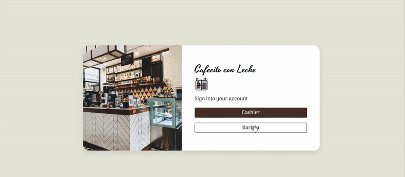
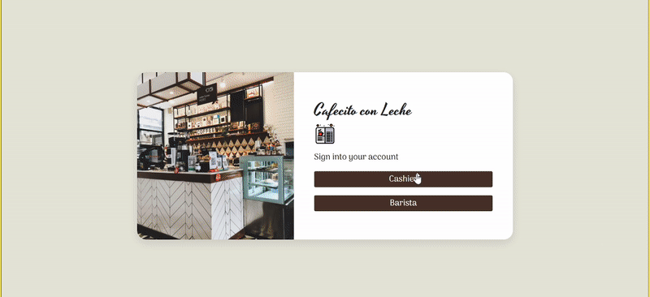

# Cafe con Leche
Café con Leche is an app that allows the caffe team to take drink orders by customer name and organizes orders to be checked off by the barista. From the cashier side, the app works like a POS system that sends the order to the barista. Once the barista checks the order as completed, the order will go back to the cashier side. The cashier will then receive the order to serve the customer. The customer’s name and order is said out loud when the order is complete.
<article>
      

  

<table>
  <tbody><tr>
    <td width="100%" valign="top">
      <h3><a id="user-content-portfolio" class="anchor" aria-hidden="true" href="#portfolio"><svg class="octicon octicon-link" viewBox="0 0 16 16" version="1.1" width="16" height="16" aria-hidden="true"><path fill-rule="evenodd" d="M7.775 3.275a.75.75 0 001.06 1.06l1.25-1.25a2 2 0 112.83 2.83l-2.5 2.5a2 2 0 01-2.83 0 .75.75 0 00-1.06 1.06 3.5 3.5 0 004.95 0l2.5-2.5a3.5 3.5 0 00-4.95-4.95l-1.25 1.25zm-4.69 9.64a2 2 0 010-2.83l2.5-2.5a2 2 0 012.83 0 .75.75 0 001.06-1.06 3.5 3.5 0 00-4.95 0l-2.5 2.5a3.5 3.5 0 004.95 4.95l1.25-1.25a.75.75 0 00-1.06-1.06l-1.25 1.25a2 2 0 01-2.83 0z"></path></svg></a>Demo</h3>
            
        
<strong>Barista side of the App</strong> -> CRUD App NodeJS

    </td>
  </tr>
</tbody></table>
</article>
<article>
      

  

<table>
  <tbody><tr>
    <td width="100%" valign="top">
      <h3><a id="user-content-portfolio" class="anchor" aria-hidden="true" href="#portfolio"><svg class="octicon octicon-link" viewBox="0 0 16 16" version="1.1" width="16" height="16" aria-hidden="true"><path fill-rule="evenodd" d="M7.775 3.275a.75.75 0 001.06 1.06l1.25-1.25a2 2 0 112.83 2.83l-2.5 2.5a2 2 0 01-2.83 0 .75.75 0 00-1.06 1.06 3.5 3.5 0 004.95 0l2.5-2.5a3.5 3.5 0 00-4.95-4.95l-1.25 1.25zm-4.69 9.64a2 2 0 010-2.83l2.5-2.5a2 2 0 012.83 0 .75.75 0 001.06-1.06 3.5 3.5 0 00-4.95 0l-2.5 2.5a3.5 3.5 0 004.95 4.95l1.25-1.25a.75.75 0 00-1.06-1.06l-1.25 1.25a2 2 0 01-2.83 0z"></path></svg></a>Demo</h3>
            
        
<strong>Cashier side of the App</strong> -> CRUD App NodeJS

    </td>
  </tr>
</tbody></table>
</article>

## How To Use:
  - Fork the repo
  - Clone your forked repo.
  - Do 'npm install' in your terminal.
  - Run with 'npm start' in your terminal.
  - Make a new barista account

